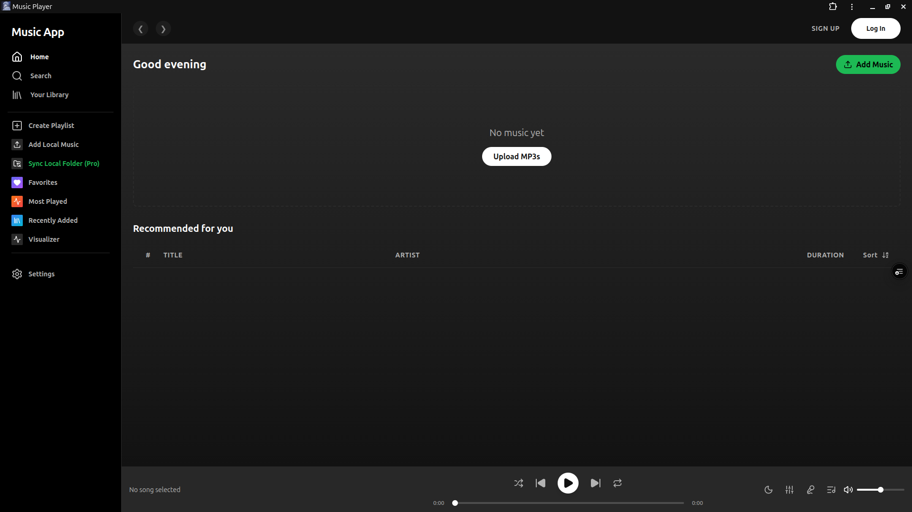

# 🎵 Modern Music Player

A premium, feature-rich web-based music player built with **React** and **Vite**. This application offers advanced capabilities like local directory synchronization, smart playlists, and a stunning visual interface.



## ✨ Key Features

### 📂 Advanced Local Sync

- **Local Folder Sync (Advanced)**: Sync your entire local music collection directly from your hard drive using the File System Access API. No need to upload files to a server!
- **Persistent Permission**: Remembers your folder access (requires one-click approval on refresh for security).
- **Metadata Extraction**: Automatically reads ID3 tags (Artist, Album, Cover Art) from your MP3 files.

### 🎧 Premium Playback Experience

- **Crossfade & Gapless**: Smooth transitions between songs with adjustable crossfade duration.
- **Smart Playlists**:
  - **Favorites**: Your liked songs in one place.
  - **Most Played**: Automatically tracks your listening habits.
  - **Recently Added**: Your latest additions to the library.
- **Scoped Playback**: Playby artist, album, or playlist with intelligent "Next/Prev" behavior that stays within context.

### 🎨 Stunning UI & Visuals

- **Real-time Visualizer**: Watch your music come to life with a frequency-based waveform visualizer.
- **Dynamic Lyrics**: Integrated lyrics viewer with editing capabilities.
- **Equalizer**: Fine-tune your sound with a 5-band frequency equalizer.
- **Theme Support**: Toggle between Dark and Light modes with customizable accent colors.

## 🛠️ Tech Stack

- **Framework**: [React 19](https://react.dev/)
- **Build Tool**: [Vite](https://vitejs.dev/)
- **Styling**: [Tailwind CSS](https://tailwindcss.com/) & Vanilla CSS
- **Database**: [IndexedDB](https://developer.mozilla.org/en-US/docs/Web/API/IndexedDB_API) (via Dexie-like implementation) for metadata & file handles.
- **Icons**: [Lucide React](https://lucide.dev/)
- **Metadata**: [jsmediatags](https://github.com/aadsm/jsmediatags)
- **Audio API**: [Web Audio API](https://developer.mozilla.org/en-US/docs/Web/API/Web_Audio_API) for visualizer and equalizer.

## 🚀 Getting Started

### Prerequisites

- [Node.js](https://nodejs.org/) (v18 or higher)
- [npm](https://www.npmjs.com/) or [yarn](https://yarnpkg.com/)

### Installation

1. Clone the repository:

   ```bash
   git clone https://github.com/NXRts/Music-Player.git
   ```

2. Navigate to the project directory:

   ```bash
   cd music-player
   ```

3. Install dependencies:

   ```bash
   npm install
   ```

4. Start the development server:

   ```bash
   npm run dev
   ```

## 📝 Important Note

The **Local Folder Sync** feature requires the **File System Access API**, which is currently supported in Chromium-based browsers (Chrome, Edge, Brave). Support for other browsers may vary.

---

Built with ❤️ by [NXRts](https://github.com/NXRts)
